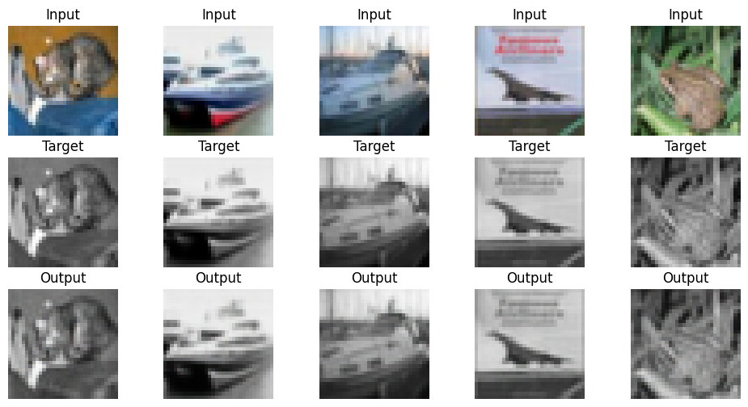

# Week 5 — Image-to-Image Translation (Baseline CNN)

This lab implements a baseline Encoder–Decoder CNN for paired image-to-image translation using the CIFAR-10 dataset.

---

## Objective

To implement a simple encoder–decoder CNN and analyze its performance using reconstruction loss (L1 / MSE).

---

## Method

### Dataset
CIFAR-10 (32x32 RGB images)

### Task
Input: RGB image  
Target: Grayscale version of the same image  

This creates paired training data.

---

## Model Architecture

Encoder:
- Conv2D layers with downsampling

Decoder:
- Conv2DTranspose layers for upsampling
- Final activation: `tanh`

---

## Loss Functions

- L1 Loss (MAE)
- MSE (Mean Squared Error)

---

## Result

Below is a sample output from the trained model:

---

## Why Are the Output Images Blurry?

The model is trained only using reconstruction loss (L1 / MSE).

These losses minimize pixel-wise differences between predicted and target images.

Because of this:
- The network learns the average of possible outputs
- High-frequency details are not preserved
- Images appear smooth and blurry

This is a known limitation of baseline encoder–decoder models without GANs.

To generate sharper images, an adversarial loss (GAN) is required.

---

## Conclusion

The encoder–decoder CNN successfully learns image translation but produces blurry results due to the use of pixel-based reconstruction loss.

This baseline model forms the foundation for GAN-based image-to-image translation models such as Pix2Pix.