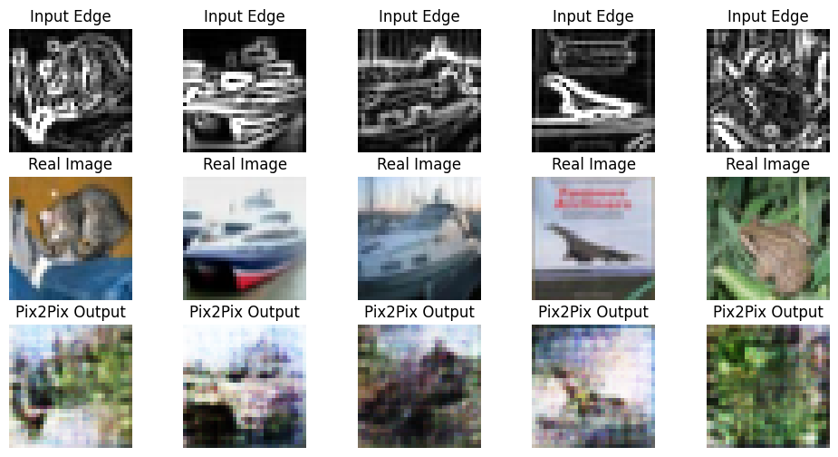

# Week 6 — Pix2Pix GAN (Image-to-Image Translation)

This lab implements Pix2Pix, a conditional GAN (cGAN) for paired image-to-image translation.

---

## Objective

To implement Pix2Pix using:
- U-Net Generator
- PatchGAN Discriminator
- Adversarial + L1 Loss

And compare results with the baseline CNN (Lab-5).

---

## Dataset

CIFAR-10

Input: Edge-detected image  
Target: Original RGB image  

This creates paired training data.

---

## Architecture

### Generator — U-Net
- Encoder–Decoder structure
- Skip connections preserve spatial details
- Final activation: `tanh`

### Discriminator — PatchGAN
- Classifies local image patches
- Encourages sharp textures
- Outputs patch-level authenticity map

---

## Loss Functions

Generator Loss:
- Adversarial Loss (Binary Crossentropy)
- L1 Reconstruction Loss
- Total Loss = GAN Loss + λ × L1 Loss

Discriminator Loss:
- Real image classification
- Fake image classification

---

## Result

Below is a sample Pix2Pix output:

---

## Performance Comparison

| Feature | Baseline CNN | Pix2Pix GAN |
|----------|-------------|-------------|
| Loss | L1 / MSE | Adversarial + L1 |
| Sharpness | Blurry | Sharper |
| Texture Realism | Low | Improved |
| Detail Preservation | Limited | Better |

Pix2Pix produces significantly sharper and more realistic outputs compared to the baseline encoder–decoder CNN.

---

## Conclusion

Pix2Pix improves image-to-image translation quality by introducing adversarial learning.

GAN-based training forces the generator to produce realistic textures and reduces blur compared to simple reconstruction-based models.